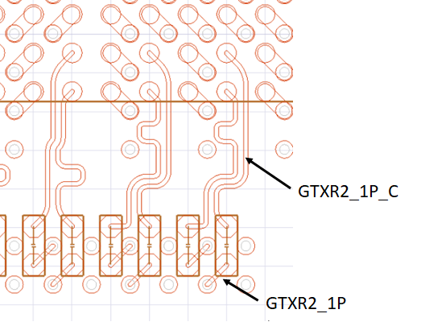

# AutoXNet
## 菜单位置
Net->AutoXNet

## 功能描述
当信号线经过电容并且一侧的网络没有使用命名（网络为数字或者随机名称），本脚本可以根据一侧已经命名的网络，对另外一侧进行命名，新命名的网络会根据RLC的不同添加_C,_R,_L的标志。（当前默认只对Cap）

## 操作说明
确保3D Layout工程处于选中状态，然后在Toolbox上右键，选择 Net->AutoXNet. 脚本会自动在当前激活的AEDT里面执行，检测电容两侧的网络，对于未命名的网络进行命名。

## 注意事项
- 脚本会直接跳过3D Layout里面定义的Power/GND网络。
- Cap需要分配到Component的Capacitors里面

