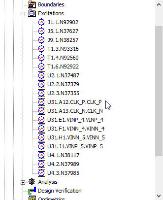

# RenameEdgePort
## 菜单位置
Port->RenameEdgePort

## 功能描述
对3D Layout里面手动添加的Port进行重命名，方便识别。

## 命名规则：
- 如果Port位置Pin上，则以 refdes.pin.Net方式命名，比如 U1.A2.DQ0
- 如果Port位置不在Pin上，则以网络名称进行命名

## 操作说明
手动添加Port后，保持3D Layout窗口在最前面，运行Port->RenameEdgePort命令，Port会自动更新。

## 完成效果
### 命名前  

### 命名后：  

## 注意事项
暂时不支持对耦合的waveport进行命名，比如1个waveport包含2个及以上的terminal的情况。

