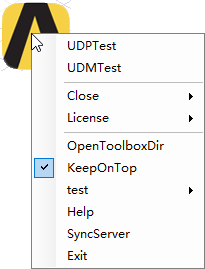
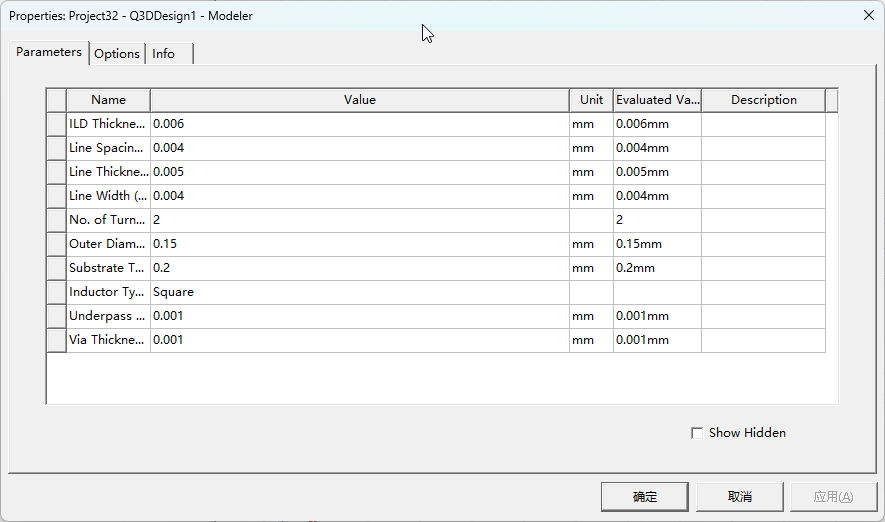
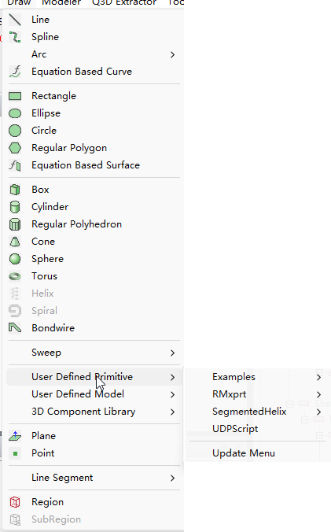

# 添加UDM/UDP脚本
UDM,UDP可以实现更加复杂的模型构建，可以在HFSS, Icepak, Maxwell3D, 和Q3D中使用。  
工具支持将UDM和UDP脚本添加到菜单中，具体方法如下：  

```xml
	<SubMenu Type="MenuItem" Name="UDPTest" ExecuteType="Python" Path="xxxx/geodesic_sphere.py" EntryFunc="$UDP" LogWindow="False"></SubMenu>
	<SubMenu Type="MenuItem" Name="UDMTest" ExecuteType="Python" Path="xxxx/OnDieSpiralInductor.py" EntryFunc="$UDM" LogWindow="False"></SubMenu>
```
## 参数说明
等EntryFunc设定为$UDM，工具会认为执行的脚本为UDM脚本，工具会将脚本发送到对应的AEDT窗口，执行UDM命令。  
等EntryFunc设定为$UDP，工具会认为执行的脚本为UDP脚本，工具会将脚本发送到对应的AEDT窗口，执行UDP命令。  
发布时建议LogWindow设置为"False"，避免弹出日志窗口。
其它参数请参考[Write your Script]中的说明。  

UDM和UDP脚本的编写方法请参考Help说明，按照正常的步骤编写脚本，并保存为.py文件即可，脚本可以放置在任意位置，如果放置在工具目录可以使用先对路径。
UDM和UDP的执行效果和软件点击菜单执行效果一致，会弹出设置窗口。。  

1. 在右键菜单中选择对应的UDP或者UDM脚本  
  

2. 弹出UDP/UDM设置窗口  
  

Note: 工具会在UDM/UDP下面自动添加一个UDMScript/UDPScript菜单项作为入口，如果产出会重新产生。
（如果用户在sysLib目录没有权限，可以尝试将DMScript/UDPScript手动添加到UserLib目录下）  

  